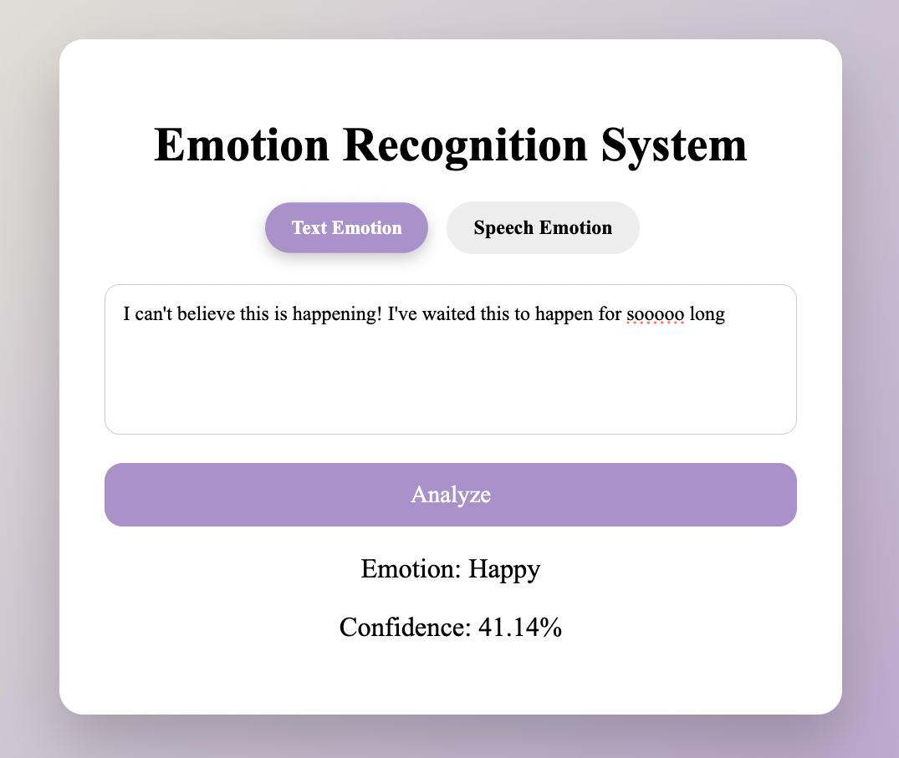
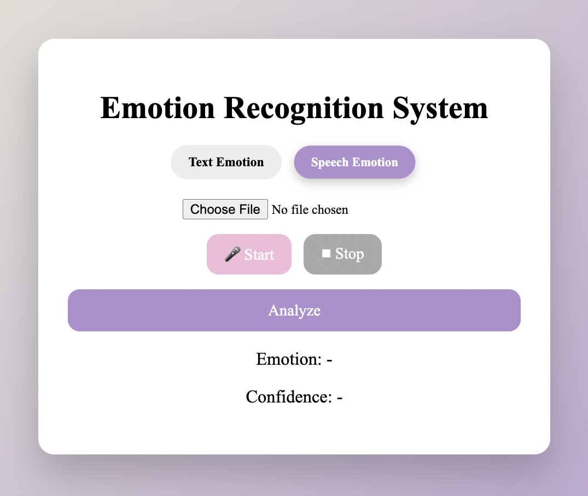
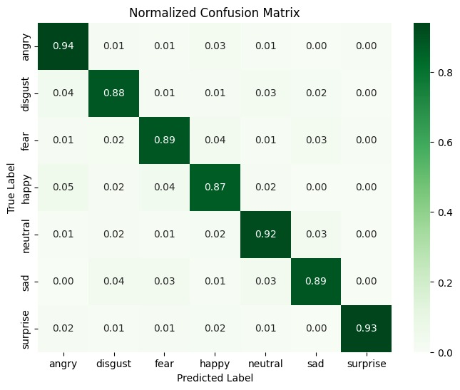
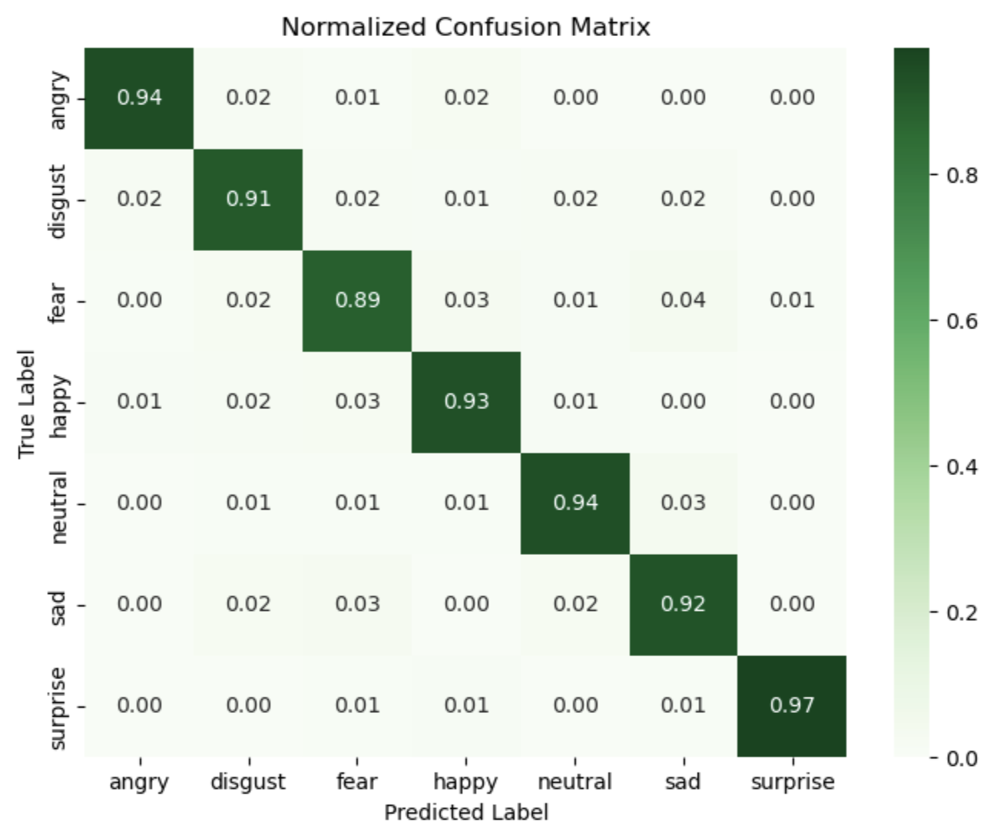

# Multimodal Emotion Recognition System

A web application that recognises human emotion from **text** and **speech** using deep learning. It classifies inputs into seven emotions (Angry, Disgust, Fear, Happy, Neutral, Sad, Surprise) and returns a confidence score, through a Flask interface that supports typed text, audio upload and live microphone recording.

| Text emotion | Speech emotion |
|---|---|
|  |  |

## Highlights

| Modality | Final model | Test accuracy | Improvement over baseline |
|---|---|---|---|
| Speech | CRNN + Temporal Regularization | **92.30%** | +2.45 pts over CNN + LSTM |
| Text | Relative EA-LSTM + rule-based emoji detector | **60.19%** | +11.19 pts over LSTM |

- **Temporal regularization loss for speech**: a new training objective that penalises abrupt changes between frame-level predictions, producing smoother and more reliable emotion tracking over time.
- **Emotion-Aware LSTM (EA-LSTM)**: a custom LSTM cell that injects an emotion-lexicon vector directly into the cell's long-term memory.
- **Relative Multi-head Attention**: multi-head self-attention with learnable relative positional bias, placed before the LSTM to guide its sequence learning.

---

## Speech Emotion Recognition

### Architecture

A Convolutional Recurrent Neural Network (CRNN) built in PyTorch:

```
Audio (.wav) → Log-Mel spectrogram (128 × 108)
            → CNN  [Conv 32 → Conv 64, BatchNorm, ReLU, MaxPool, Dropout]
            → LSTM (128 units) over 25 time steps
            → Frame-level classifier → mean over time → utterance-level emotion
```

The CNN learns local spectral and prosodic patterns, while the LSTM models how emotion evolves across the utterance.

### Novelty: Temporal Regularization

Standard cross-entropy only supervises the final, averaged prediction, so the frame-level predictions underneath can fluctuate wildly while still producing the same output. Since emotion in speech tends to change gradually, we add a regularization term that penalises large differences between predictions at adjacent time steps:

$$
L_{temp} = \frac{1}{T-1}\sum_{t=2}^{T}\lVert \hat{y}_t - \hat{y}_{t-1} \rVert^2
\qquad
L_{total} = L_{CE} + \lambda \, L_{temp}
$$

The weight λ was selected by grid search over {0.1, 0.5, 1.0} on the validation set, with **λ = 0.1** performing best. The term changes only the training objective, not the model architecture, so it adds no inference cost. See [`emotion/speech_model.py`](emotion/speech_model.py).

### Results

Ablation study on the held-out test set:

| Model | Accuracy | Macro F1 | Weighted F1 |
|---|---|---|---|
| CNN + BiLSTM | 88.09% | – | – |
| CNN + LSTM (baseline) | 89.85% | 0.90 | 0.90 |
| **CNN + LSTM + Temporal Regularization** | **92.30%** | **0.93** | **0.92** |

Temporal regularization raised recall for five of the seven emotions, with the largest gains on happy (0.87 → 0.93) and surprise (0.93 → 0.97); angry and fear were unchanged. It also produced faster convergence and a smaller gap between training and validation accuracy, which points to less overfitting.

| Baseline CNN + LSTM | With Temporal Regularization |
|---|---|
|  |  |

---

## Text Emotion Recognition

### Architecture

A hybrid system in TensorFlow/Keras:

1. **Rule-based emoji detector**: if the input contains a known emoji, its mapped emotion is returned directly.
2. **Relative EA-LSTM**: otherwise the cleaned text is passed to a neural model that combines:
   - **Relative Multi-head Attention** (8 heads) with a learnable relative positional bias, whose output guides the LSTM.
   - **EA-LSTM cell**, which adds an *Emotion Memory Candidate* computed from an NRC Emotion Lexicon vector straight into the cell state. A learnable strength parameter α lets the model amplify or ignore emotional cues as needed.

See [`emotion/text_model.py`](emotion/text_model.py).

### Results

| Model | Accuracy |
|---|---|
| LSTM (baseline) | 49.00% |
| LSTM + Spatial Attention | 50.13% |
| LSTM + Emotion Memory Candidate (EA-LSTM) | 53.35% |
| LSTM + Multi-head Attention | 54.09% |
| LSTM + Relative Multi-head Attention | 57.64% |
| **Relative EA-LSTM** | **60.19%** |

---

## Datasets

| Task | Dataset | Size |
|---|---|---|
| Speech | [CREMA-D, RAVDESS, SAVEE and TESS combined](https://www.kaggle.com/datasets/dmitrybabko/speech-emotion-recognition-en) | 12,162 clips |
| Text | [Emotion Detection Dataset (social media text)](https://www.kaggle.com/datasets/mayurjare/emotion-datasets) | 31,018 samples after cleaning |

**Speech preprocessing:** labels were standardised to seven classes across the four corpora. The training data was augmented with noise addition, time shifting, pitch shifting and time stretching, then converted to normalised log-Mel spectrograms. The data was split 60/20/20 into training, validation and test sets.

**Text preprocessing:** the "shame" class was removed to match the speech label set, and 3,628 duplicate rows were dropped. Text was lower-cased, contractions were expanded, URLs, mentions and non-alphabetic characters were removed, and words were lemmatised with WordNet.

The datasets are not redistributed in this repository. Please download them from the links above.

---

## Getting Started

### Prerequisites

- Python 3.11 – 3.13

### Installation

```bash
git clone https://github.com/ambergiselle/Multimodal-Emotion-Recognition-via-Temporally-Regularized-CRNN.git
cd Multimodal-Emotion-Recognition-via-Temporally-Regularized-CRNN

python -m venv venv
source venv/bin/activate        # Windows: venv\Scripts\activate

pip install -r requirements.txt
```

### Run

```bash
python app.py
```

Then open <http://127.0.0.1:5000> in your browser. Required NLTK data is downloaded automatically on first run.

Set `FLASK_DEBUG=1` to enable Flask debug mode during development.

### Usage

- **Text tab**: type a sentence (emojis are supported) and click **Analyze**.
- **Speech tab**: upload an audio file (WAV recommended) or record with your microphone, then click **Analyze**.

---

## Project Structure

```
emotion-recognition/
├── app.py                  # Flask server and API routes
├── emotion/
│   ├── speech_model.py     # CRNN, temporal regularization loss, audio feature extraction
│   └── text_model.py       # EA-LSTM cell, Relative Multi-head Attention, text preprocessing
├── models/                 # Trained weights, tokenizer and emoji rules
├── static/                 # Front-end CSS and JavaScript (Web Audio API recording)
├── templates/              # HTML template
├── docs/images/            # Figures used in this README
└── requirements.txt
```

### API

| Endpoint | Method | Input | Output |
|---|---|---|---|
| `/analyze_text` | POST | JSON `{"text": "..."}` | `{"emotion": "Happy", "confidence": 87.5}` |
| `/analyze_speech` | POST | multipart form, field `audio` | `{"emotion": "Angry", "confidence": 93.1}` |

---

## Limitations and Future Work

- The speech model performs best on clean, studio-quality audio. Accuracy drops on live microphone recordings with background noise or different recording conditions.
- Temporal regularization assumes emotions change smoothly, so sudden emotional spikes such as abrupt anger or surprise may be under-represented.
- The text model struggles with the *Neutral* and *Disgust* classes because of class imbalance.
- Future work: train on larger, more balanced data, add noise-robust training, and support a wider range of emotion categories.

---

## Team

| Member | Contribution |
|---|---|
| **Chee Hui Sheen** | Speech emotion recognition: CRNN and temporal regularization novelty |
| Kong Yenly | Speech emotion recognition: CRNN and temporal regularization |
| Wong Hui Xuan | Relative Multi-head Attention LSTM, Relative EA-LSTM, user interface |
| Koh Zhi Ling | EA-LSTM, Relative EA-LSTM |
| Pang Siao Xuan | Data preprocessing, rule-based emoji model, hybrid text model |

## Tech Stack

Python · PyTorch · TensorFlow / Keras · Librosa · NLTK · Flask · HTML / CSS / JavaScript · Web Audio API
